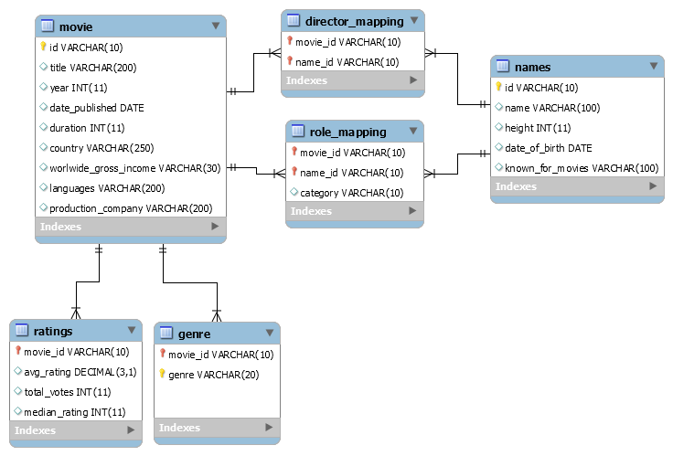
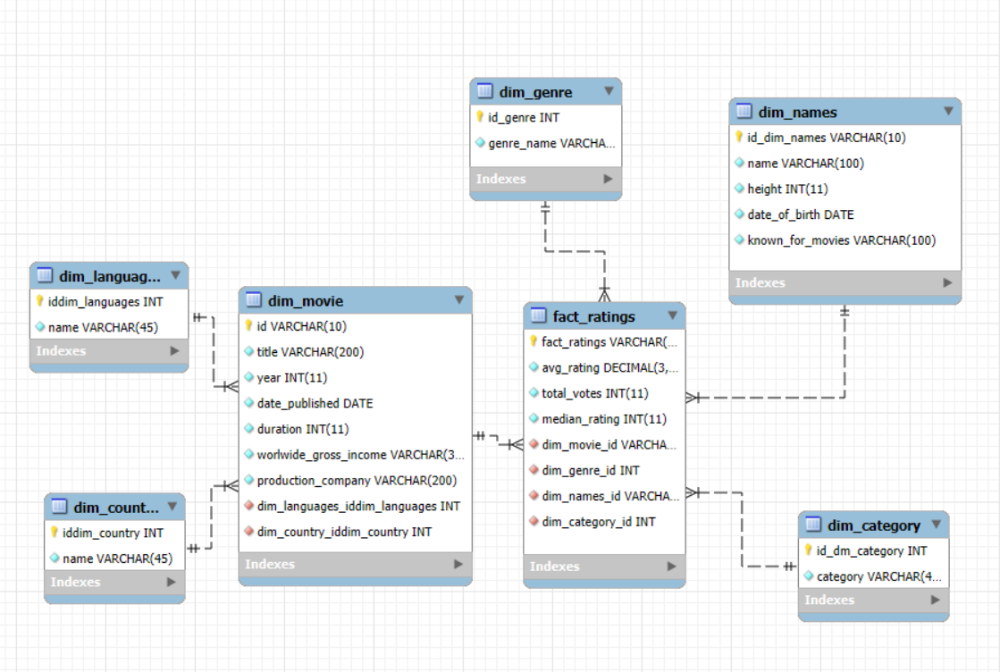
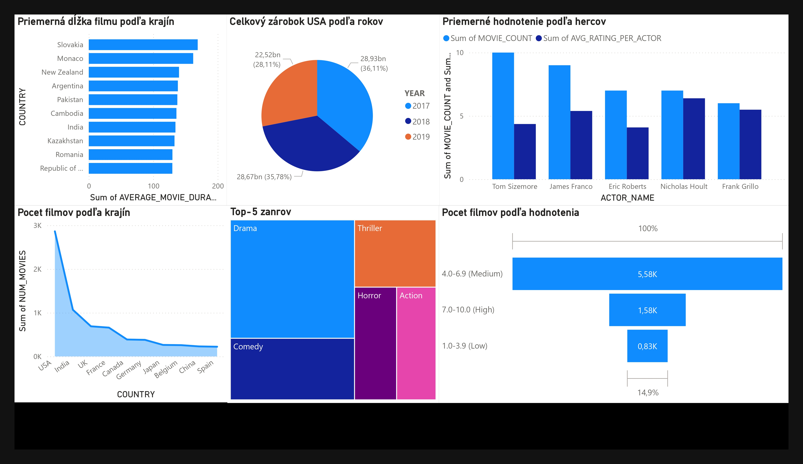

# **ETL proces datasetu IMDb**
    Tento repozitár obsahuje implementáciu ETL procesu v Snowflake pre analýzu dát z IMDb.
Projekt sa zameriava na preskúmanie preferencií divákov, ich správania a charakteristík filmov na základe hodnotení, žánrov a filmových tímov. Výsledný model dát umožňuje vykonávať viacrozmernú analýzu a vizualizovať kľúčové metriky.

# **knižnica**
- `CREATE DATABASE, CREATE SCHEMA`: Vytvorenie databázy a schémy.
- `USE SCHEMA`: Nastavenie aktívnej schémy.
- `CREATE TABLE, CREATE SEQUENCE`: Vytvorenie tabuliek a sekvencií.
- `COPY INTO`: Načítanie dát zo súborov do tabuliek.
- `INSERT INTO`: Vkladanie dát do tabuliek.
- `SELECT, DISTINCT, JOIN (LEFT, INNER), UNION`: Výber a spájanie dát z rôznych tabuliek.
- `LATERAL FLATTEN, ARRAY_AGG, POSITION`: Práca s poliami a reťazcami.
- `MERGE INTO`: Zlučovanie dát.
- `ALTER TABLE`: Úpravy tabuliek (pridanie stĺpcov).
- `DROP TABLE`: Odstránenie tabuliek.
- `TRIM, EXTRACT, NULL_IF`: Úprava a manipulácia s dátami.
- `FILE_FORMAT, SKIP_HEADER`: Nastavenie formátu súboru pri načítaní dát.
- `ROUND`: Zaokrúhľovanie hodnôt na požadovaný počet desatinných miest.
- `COUNT`: Počítanie jedinečných hodnôt v stĺpci.
- `CASE`: Podmienená logika pre kategorizáciu alebo transformáciu hodnôt.
- `GROUP BY`: Agregácia hodnôt podľa definovaných kritérií.
- `ORDER BY`: Zoraďovanie výsledkov podľa určitého stĺpca.
- `LIMIT`: Obmedzenie počtu výsledkov na určený počet.
- `WHERE, HAVING`: Filtrovanie výsledkov na základe podmienok.
- `EXTRACT`: Extrahovanie roku alebo iných častí dátumu z dátumového stĺpca.
- `REPLACE`: Nahradenie reťazcov v údajoch.


_______________________

## **1. Úvod a popis zdrojových dát**
    Cieľom semestrálneho projektu je analyzovať dáta týkajúce sa filmov, divákov a ich hodnotení.
Zdrojové dáta pochádzajú z EDU datasetu dostupného [tu](https://edu.ukf.sk/mod/folder/view.php?id=252868). Dataset obsahuje
## Hlavné tabuľky:
- `movie`
- `ratings`
- `genre`
- `names`

## Podriadené tabuľky:
- `director_mapping`
- `role_mapping`

Účelom ETL procesu bolo tieto dáta pripraviť, transformovať a sprístupniť pre viacdimenzionálnu analýzu.
_______________________


### **1.1 Dátová architektúra**

### **ERD diagram**
Surové dáta sú usporiadané v relačnom modeli, ktorý je znázornený na **entitno-relačnom diagrame (ERD)**:

<p align="center">
  
  <br>
  <em>Obrázok 1 Entitno-relačná schéma IMDb</em>
</p>


_______________________


## **2. Dimenzionálny model**

Navrhnutý bol model **(Snowflake schema)** pre efektívnu analýzu, kde centrálny bod tvorí faktová tabuľka **'fact_ratings'**, ktorá je prepojená s nasledujúcimi dimenziami:

- **'dim_movie'**: Obsahuje podrobné informácie o filmoch (názov, rok vydania, dátum publikácie, dĺžka trvania, celosvetový príjem, produkčná spoločnosť).

- **'dim_names'**: Uchováva informácie o menách (meno, výška, dátum narodenia, známe filmy).

- **'dim_genre'**: Obsahuje informácie o žánroch filmov (názov žánru).

- **'dim_category'**: Uchováva kategórie pre hercov a režisérov (režisér, herec, atď.).

- **'dim_languages'**: Obsahuje jazyky, v ktorých boli filmy vydané.

- **'dim_countries'**: Uchováva krajiny, v ktorých boli filmy vydané.

<p align="center">
  
  <br>
  <em>Obrázok 2 Schéma snowflake pre IMDb</em>
</p>

Zvolil som Snowflake Schema, pretože je optimálne vhodná na prácu s komplexnými analytickými dotazmi. Táto štruktúra umožňuje efektívne ukladať dáta, minimalizovať duplicitu a ľahko sa prispôsobiť zmenám. Vďaka normalizácii tabuliek Snowflake Schema zjednodušuje správu veľkých objemov dát a poskytuje vysokú flexibilitu pri vykonávaní analýz v moderných systémoch spracovania dát.
_______________________

## **3. ETL proces v Snowflake**
ETL proces pozostával z troch hlavných fáz: `extrahovanie` (Extract), `transformácia` (Transform) a `načítanie` (Load). 
Tento proces bol implementovaný v Snowflake s cieľom pripraviť zdrojové dáta zo staging vrstvy do viacdimenzionálneho modelu vhodného na analýzu a vizualizáciu.

_______________________


### **3.1 Extract (Extrahovanie dát)**
Dáta zo zdrojového datasetu vo formáte `.csv` boli najprv nahrané do Snowflake cez interné stage úložisko s názvom `movie_data_stage`. Stage slúži ako dočasné úložisko na rýchle nahrávanie a spracovanie dát. Vytvorenie stage bolo zabezpečené príkazom:

```sql 
    CREATE OR REPLACE STAGE movie_data_stage;
 ```

Po vytvorení stage, boli doň nahraté súbory obsahujúce údaje o filmoch, hercoch, žánroch, hodnoteniach, režiséroch a kategóriách. Na nahrávanie dát do staging tabuliek sa použil príkaz `COPY INTO`, ktorý importoval dáta z jednotlivých súborov (napríklad movie.csv, ratings.csv, names.csv a iné).

Príklad kódu na načítanie dát:

```sql 
    COPY INTO movie_staging
    FROM @movie_data_stage/movie.csv
    FILE_FORMAT = (TYPE = 'CSV' FIELD_OPTIONALLY_ENCLOSED_BY = '"' SKIP_HEADER = 1);
 ```
V prípade, že počas nahrávania došlo k nekompletným alebo nekonzistentným záznamom, bol použitý parameter ON_ERROR = 'CONTINUE', ktorý umožnil pokračovanie procesu bez prerušenia, pričom chyby sa ignorovali.

Tieto dáta, po nahratí do staging tabuliek, poskytujú základ pre ďalšie spracovanie v ďalších krokoch ETL procesu, kde budú transformované a neskôr uložené v dimenziách a faktových tabuľkách pre analytické účely.

### **3.2 Transfor (Transformácia dát)**

V rámci transformácie bolo zmenených niekoľko tabuliek: `movie_staging`, `genre_staging`, `director_mapping_staging` a `role_mapping_staging`.

3.2.1. 
`movie_staging` : 
movie_staging obsahovala polia s viacerými jazykmi a krajinami, ktoré boli uložené ako zoznamy. Preto som sa rozhodol tieto údaje normalizovať a presunúť ich do samostatných dimenzionálnych tabuliek dim_languages a dim_countries, pričom každému záznamu bol priradený jedinečný identifikátor (ID).

Príklad kódu:

```sql 
CREATE SEQUENCE dim_language_seq START WITH 1 INCREMENT BY 1;

CREATE TABLE dim_languages (
  id_language INT DEFAULT dim_language_seq.NEXTVAL PRIMARY KEY,
  language_name VARCHAR(100) UNIQUE
);
```
Takéto vytvorenie tabuliek umožňuje presnejšiu analýzu dát a vytváranie prehľadnejších grafov, keďže údaje sú normalizované a rozdelené do samostatných dimenzií, čo zjednodušuje ich spracovanie a interpretáciu.

Aby údaje vyzerali ako zoznam, použil som funkciu `LATERAL` `FLATTEN` v kombinácii s rozdelením reťazca pomocou funkcie `SPLIT`. Týmto spôsobom boli hodnoty oddelené a spracované ako jednotlivé záznamy, čo umožnilo ich jednoduché vloženie do dimenzionálnych tabuliek.

Príklad kódu:
```sql 
INSERT INTO dim_languages (language_name)
SELECT
  DISTINCT TRIM(VALUE) AS language_name
FROM
  dim_movie, LATERAL FLATTEN(INPUT => SPLIT(languages, ','))
WHERE
  TRIM(VALUE) IS NOT NULL;
```
Vytvorenie dočasných máp
Použitím dočasných tabuliek (temp_language_map a temp_country_map) boli prepojené ID jazykov a krajín s filmami:

temp_language_map: Obsahuje mapovanie medzi filmami a ich jazykmi.
temp_country_map: Obsahuje mapovanie medzi filmami a krajinami.

Dočasná tabuľka slúži na priradenie jedinečných ID jazykov z tabuľky dim_languages k jednotlivým filmom v tabuľke dim_movie. Pôvodné údaje o jazykoch vo filme boli uložené ako textové zoznamy. Táto operácia zabezpečuje, že každý jazyk je reprezentovaný svojím ID, čím sa zjednodušuje manipulácia s dátami. Tento proces je realizovaný príkazom:
```sql 
CREATE TEMPORARY TABLE temp_language_map AS
SELECT
  dm.id AS movie_id,
  ARRAY_AGG(dl.id_language) AS language_ids
FROM
  dim_movie dm
  JOIN dim_languages dl ON POSITION(TRIM(dl.language_name) IN dm.languages) > 0
GROUP BY dm.id;
MERGE INTO dim_movie dm USING temp_language_map tm ON dm.id = tm.movie_id
WHEN MATCHED THEN
UPDATE SET dm.language_ids = tm.language_ids;
```

Dočasná tabuľka zabezpečuje prevod pôvodného textového zoznamu jazykov na štruktúrovaný formát. Namiesto toho, aby sa jazyk ukladal ako text (napríklad "angličtina, španielčina"), sú jazykové hodnoty mapované na konkrétne ID z dim_languages a ukladané ako pole ID (ARRAY) v tabuľke dim_movie. Tento proces je realizovaný prostredníctvom:

```sql 
MERGE INTO dim_movie dm
USING temp_language_map tm
ON dm.id = tm.movie_id
WHEN MATCHED THEN
UPDATE SET dm.language_ids = tm.language_ids;
```
Celkovo, dočasná tabuľka zohráva kľúčovú rolu pri transformácii dát do čistejšieho, normalizovaného formátu, čo zabezpečuje lepšiu integritu, konzistenciu a efektívnosť pri ďalšom spracovaní a analýze dát.

!Po vykonaní SQL dotazov odstránime všetky dočasné tabuľky, ktoré už nie sú potrebné pre daný časový úsek.!


3.2.2
`genre_staging` : 
Tabuľka genre_staging obsahovala údaje o žánroch filmov, ktoré boli pôvodne uložené ako textové hodnoty. Aby som tieto údaje normalizoval a zjednodušil ich ďalšie spracovanie, rozhodol som sa vytvoriť samostatnú dimenzionálnu tabuľku dim_genre. V tejto tabuľke budú žánre uložené ako jedinečné hodnoty s priradenými ID, čím sa umožní efektívnejšie spracovanie a analýza dát.

```sql 
CREATE SEQUENCE dim_genre_seq START WITH 1 INCREMENT BY 1;

CREATE TABLE dim_genre (
    id_genre INT DEFAULT dim_genre_seq.NEXTVAL PRIMARY KEY,
    genre_name VARCHAR(100) NOT NULL
);
```
Následne som vložil jedinečné žánre zo genre_staging do tabuľky dim_genre, aby som zabezpečil, že každý žáner bude reprezentovaný len raz. Tento krok pomohol odstrániť redundanciu a zjednodušil analýzu:


```sql 
INSERT INTO dim_genre (genre_name)
SELECT DISTINCT genre
FROM genre_staging;
```


3.2.3
`director_mapping_staging` a `role_mapping_staging`:

Takže, rovnako ako pre filmy, aj pre kategórie som vytvoril dočasnú tabuľku, aby som skombinoval všetky potrebné údaje pre novú tabuľku dim_category.

Príklad kódu:
```sql 
CREATE TABLE role_and_director_mapping_staging AS
SELECT
  movie_id,
  names_id,
  'Director' AS category
FROM
  MovieDB.staging.director_mapping_staging
UNION
SELECT
  movie_id,
  names_id,
  category
FROM
  MovieDB.staging.role_mapping_staging;
```
Po tom, ako boli všetky údaje skombinované na jednom mieste, som vytvoril novú tabuľku dim_category, ktorá bude v budúcnosti prepojená s hlavnou tabuľkou fact_ratings.

Príklad kódu:

```sql 
CREATE SEQUENCE category_id_seq START WITH 1 INCREMENT BY 1;
CREATE TABLE dim_category (
    id_dim_category INT DEFAULT category_id_seq.NEXTVAL PRIMARY KEY,
    category VARCHAR(100) NOT NULL
);
```
Príkaz `SELECT DISTINCT category` zabezpečuje, že sa do dim_category vloží len unikátna kategória, čím sa vytvárajú jedinečné záznamy v dimenzii kategórií pre ďalšiu analýzu.

3.2.4
`fact_ratings`:
Fact_ratings tabuľka bola upravená hlavne v súvislosti s pridaním nových cudzích kľúčov a priradením správnych ID z dimenzií (ako dim_movie, dim_genre, dim_names a dim_category). Tento proces zabezpečuje, že všetky faktové údaje v tabuľke fact_ratings sú prepojené so správnymi dimenziami cez cudzí kľúč, čím sa umožňuje efektívne spracovanie.

Príklad kódu:
```sql 
INSERT INTO fact_ratings (
    avg_rating,
    total_votes,
    median_rating,
    dim_movie_id,
    dim_genre_id,
    dim_names_id,
    dim_category_id
)
SELECT
    rs.avg_rating,
    rs.total_votes,
    rs.median_rating,
    m.id AS dim_movie_id,
    dg.id_genre AS dim_genre_id,
    n.id_dim_names AS dim_names_id,
    dc.id_dim_category AS dim_category_id
FROM
    ratings_staging rs
    JOIN movie_staging m ON rs.movie_id = m.id
    LEFT JOIN genre_staging gs ON rs.movie_id = gs.movie_id
    LEFT JOIN dim_genre dg ON gs.genre = dg.genre_name
    LEFT JOIN role_and_director_mapping_staging rdms ON rs.movie_id = rdms.movie_id
    LEFT JOIN dim_names n ON rdms.names_id = n.id_dim_names
    LEFT JOIN dim_category dc ON rdms.category = dc.category
WHERE
    rs.avg_rating IS NOT NULL
    AND rs.total_votes IS NOT NULL
    AND rs.median_rating IS NOT NULL;

```
### **3.3 Load (Načítanie dát)**

Po úspešnom vytvorení dimenzií a faktovej tabuľky boli dáta nahrané do finálnej štruktúry. Na záver boli staging tabuľky odstránené, aby sa optimalizovalo využitie úložiska:

```sql 
DROP TABLE IF EXISTS movie_staging;
DROP TABLE IF EXISTS genre_staging;
DROP TABLE IF EXISTS director_mapping_staging;
DROP TABLE IF EXISTS role_mapping_staging;
DROP TABLE IF EXISTS ratings_staging;
```

ETL proces v Snowflake umožnil spracovanie pôvodných dát z rôznych staging tabuliek do viacdimenzionálneho modelu typu hviezda. Tento proces zahŕňal čistenie, obohacovanie a reorganizáciu údajov. Výsledný model umožňuje efektívnu analýzu filmov, hodnotení, žánrov a ďalších faktorov, pričom poskytuje základ pre reporty a vizualizácie.


_______________________

## **4 Vizualizácia dát**

- Údaje vizualizácie predstavujú analýzu dát z mojej Snowflake schémy, ktorá zahŕňa základné kritériá analýzy, ako sú zárobok, dĺžka filmov, výkon hercov, hlavné žánre (ktoré sa najčastejšie vyskytujú v databáze) a počet hodnoteného materiálu podľa krajín.

<p align="center">
  
  <br>
  <em>Obrázok 3 Dashboard IMDb datasetu</em>
</p>


_______________________

### **Graf 1:Priemerná dĺžka filmu podľa krajín**
- Tento SQL dopyt vyberá krajiny s filmami, ktoré majú hodnotenie vyššie ako 7, a vypočíta priemernú dĺžku filmov pre každú krajinu. Výsledky sa zoradia podľa klesajúcej priemernej dĺžky a zobrazí sa 10 krajín s najvyššími hodnotami.

```sql
SELECT 
    dc.country_name AS country,
    ROUND(AVG(dm.duration), 2) AS average_movie_duration
FROM 
    dim_movie dm
JOIN 
    fact_ratings fr ON fr.dim_movie_id = dm.id
JOIN 
    LATERAL FLATTEN(INPUT => dm.country_ids) AS flattened_countries
JOIN 
    dim_countries dc ON dc.id_country = flattened_countries.VALUE
WHERE 
    fr.avg_rating > 7
    AND dm.duration IS NOT NULL
GROUP BY 
    dc.country_name
ORDER BY 
    average_movie_duration DESC
    limit 10 ;
```

### **Graf 2: Celkový zárobok USA podľa rokov**

- Tento SQL dopyt vypočíta celkový svetový príjem filmov, ktoré boli vydané v USA v rokoch 2017, 2018 a 2019. Príjem je očistený od symbolov dolára a čiarky a výsledky sú zoskupené a zoradené podľa roku.

```sql
SELECT
    EXTRACT(YEAR FROM dm.date_published) AS year,
    SUM(CAST(REPLACE(REPLACE(NULLIF(dm.worldwide_gross_income, 'NULL'), '$', ''), ',', '') AS DECIMAL(15, 2))) AS total_income
FROM
    dim_movie dm
JOIN
    LATERAL FLATTEN(INPUT => dm.country_ids) AS flattened_countries
JOIN
    dim_countries dc ON dc.id_country = flattened_countries.VALUE
WHERE
    dc.country_name = 'USA'
    AND EXTRACT(YEAR FROM dm.date_published) IN (2017, 2018, 2019)
    AND dm.worldwide_gross_income IS NOT NULL
GROUP BY
    EXTRACT(YEAR FROM dm.date_published)
ORDER BY
    year;
```

### **Graf 3: Priemerné hodnotenie podľa hercov**
- Tento SQL dopyt vypočíta priemerné hodnotenie filmov pre každého herca, ktorý sa objavil v viac ako 5 filmoch. Výsledky sú zoradené podľa priemerného hodnotenia herca a zobrazuje sa top 10 hercov.

```sql
SELECT
    n.name AS actor_name,
    ROUND(AVG(f.avg_rating), 2) AS avg_rating_per_actor,
    COUNT(DISTINCT f.dim_movie_id) AS movie_count
FROM
    fact_ratings f
JOIN dim_names n ON f.dim_names_id = n.id_dim_names
JOIN dim_movie m ON f.dim_movie_id = m.id
WHERE
    f.avg_rating IS NOT NULL 
GROUP BY
    n.name
HAVING
    COUNT(DISTINCT f.dim_movie_id) > 5 
ORDER BY
    avg_rating_per_actor DESC
LIMIT
    10;
```

### **Graf 4:Počet filmov podľa krajín**
- Tento SQL dopyt zistí počet rôznych filmov, ktoré sú spojené s každou krajinou. Výsledky sú zoradené podľa počtu filmov v klesajúcom poradí a zobrazí sa top 10 krajín.

```sql
SELECT
    dc.country_name AS country,
    COUNT(DISTINCT dm.id) AS num_movies
FROM
    dim_movie dm
    JOIN LATERAL FLATTEN(INPUT => dm.country_ids) AS flattened_countries
    JOIN dim_countries dc ON dc.id_country = flattened_countries.VALUE
GROUP BY
    dc.country_name
ORDER BY
    num_movies DESC
limit 10;
```

### **Graf 5:Top 5 zánrov filmov**

- Tento SQL dopyt zistí počet filmov v každom žánri, ktoré boli vydané medzi rokmi 2017 a 2019. Výsledky sú zoradené podľa počtu filmov v klesajúcom poradí a zobrazí sa top 5 žánrov.

```sql
SELECT
    dg.genre_name AS genre,
    COUNT(dm.id) AS movie_count
FROM
    dim_movie dm
JOIN
    fact_ratings fr ON dm.id = fr.dim_movie_id
JOIN
    dim_genre dg ON fr.dim_genre_id = dg.id_genre
WHERE
    EXTRACT(YEAR FROM dm.date_published) BETWEEN 2017 AND 2019
GROUP BY
    dg.genre_name
ORDER BY
    movie_count DESC
LIMIT 5;
```

### **Graf 6:Počet filmov podľa hodnotenia**
- Tento SQL dopyt rozdeľuje filmy podľa hodnotenia na tri skupiny: nízke (1.0-3.9), stredné (4.0-6.9) a vysoké (7.0-10.0). Výsledky ukazujú počet filmov v každej skupine hodnotenia a sú zoradené podľa skupiny hodnotenia.

```sql
SELECT
    CASE
        WHEN avg_rating >= 1.0
        AND avg_rating <= 3.9 THEN '1.0-3.9 (Low)'
        WHEN avg_rating >= 4.0
        AND avg_rating <= 6.9 THEN '4.0-6.9 (Medium)'
        WHEN avg_rating >= 7.0
        AND avg_rating <= 10.0 THEN '7.0-10.0 (High)'
    END AS rating_group,
    COUNT(DISTINCT dim_movie_id) AS num_movies
FROM
    fact_ratings
GROUP BY
    CASE
        WHEN avg_rating >= 1.0
        AND avg_rating <= 3.9 THEN '1.0-3.9 (Low)'
        WHEN avg_rating >= 4.0
        AND avg_rating <= 6.9 THEN '4.0-6.9 (Medium)'
        WHEN avg_rating >= 7.0
        AND avg_rating <= 10.0 THEN '7.0-10.0 (High)'
    END
ORDER BY
    rating_group;
```
**Autor:** Zadoia Rodion